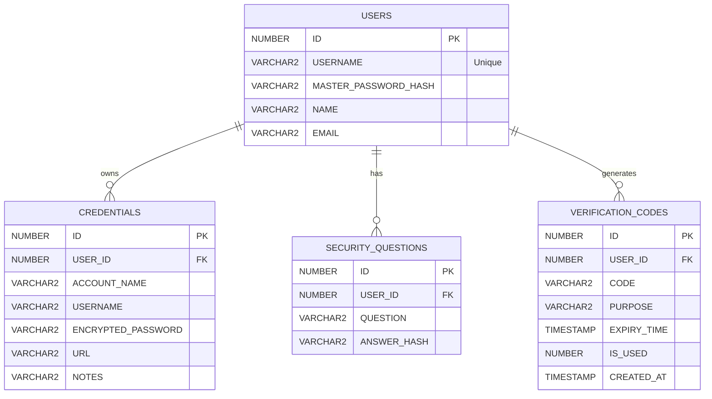
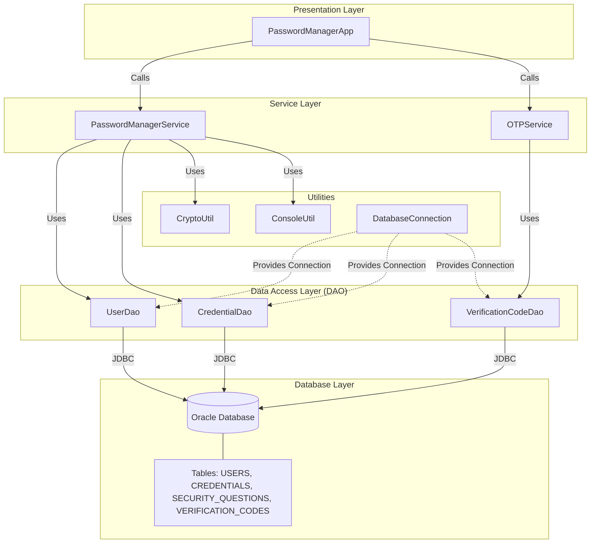

# Application Diagrams

## Entity Relationship Diagram (ERD)

```mermaid
erDiagram
    USERS {
        NUMBER ID PK
        VARCHAR2 USERNAME "Unique"
        VARCHAR2 MASTER_PASSWORD_HASH
        VARCHAR2 NAME
        VARCHAR2 EMAIL
    }

    CREDENTIALS {
        NUMBER ID PK
        NUMBER USER_ID FK
        VARCHAR2 ACCOUNT_NAME
        VARCHAR2 USERNAME
        VARCHAR2 ENCRYPTED_PASSWORD
        VARCHAR2 URL
        VARCHAR2 NOTES
    }

    SECURITY_QUESTIONS {
        NUMBER ID PK
        NUMBER USER_ID FK
        VARCHAR2 QUESTION
        VARCHAR2 ANSWER_HASH
    }

    VERIFICATION_CODES {
        NUMBER ID PK
        NUMBER USER_ID FK
        VARCHAR2 CODE
        VARCHAR2 PURPOSE
        TIMESTAMP EXPIRY_TIME
        NUMBER IS_USED
        TIMESTAMP CREATED_AT
    }

    USERS ||--o{ CREDENTIALS : owns
    USERS ||--o{ SECURITY_QUESTIONS : has
    USERS ||--o{ VERIFICATION_CODES : generates
```

## Application Architecture Diagram

```mermaid
graph TD
    subgraph "Presentation Layer"
        UI[PasswordManagerApp]
    end

    subgraph "Service Layer"
        Service[PasswordManagerService]
        OTPService[OTPService]
    end

    subgraph "Data Access Layer (DAO)"
        UserDAO[UserDao]
        CredDAO[CredentialDao]
        OTPDAO[VerificationCodeDao]
    end

    subgraph "Database Layer"
        DB[(Oracle Database)]
        Tables[Tables: USERS, CREDENTIALS, SECURITY_QUESTIONS, VERIFICATION_CODES]
    end

    subgraph "Utilities"
        Crypto[CryptoUtil]
        Console[ConsoleUtil]
        DBConn[DatabaseConnection]
    end

    %% Flows
    UI -->|Calls| Service
    UI -->|Calls| OTPService
    
    Service -->|Uses| UserDAO
    Service -->|Uses| CredDAO
    OTPService -->|Uses| OTPDAO
    
    Service -->|Uses| Crypto
    Service -->|Uses| Console
    
    UserDAO -->|JDBC| DB
    CredDAO -->|JDBC| DB
    OTPDAO -->|JDBC| DB
    
    DBConn -.->|Provides Connection| UserDAO
    DBConn -.->|Provides Connection| CredDAO
    DBConn -.->|Provides Connection| OTPDAO
    
    DB --- Tables
```
