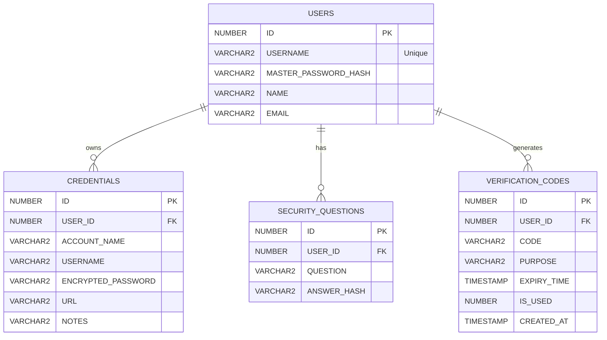
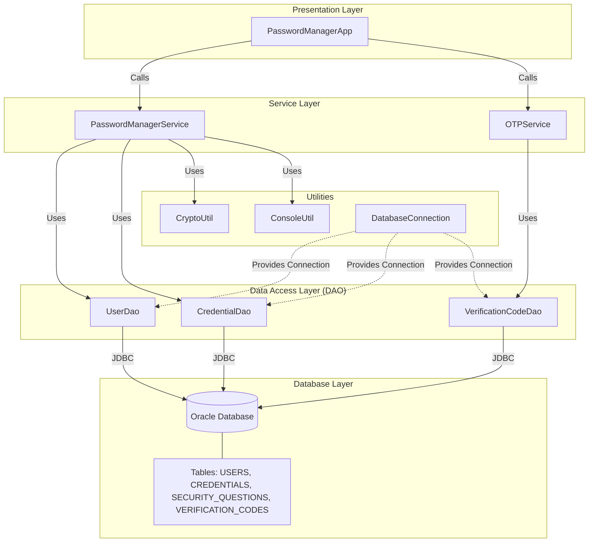

# RevPasswordManager Project Context

This document contains the complete source code and documentation for the RevPasswordManager project.


## File: docs\DIAGRAMS.md
```markdown
# Application Diagrams

## Entity Relationship Diagram (ERD)



## Application Architecture Diagram


```

## File: src\main\java\com\revpasswordmanager\PasswordManagerApp.java
```java
package com.revpasswordmanager;

import com.revpasswordmanager.controller.CredentialController;
import com.revpasswordmanager.controller.SecurityQuestionController;
import com.revpasswordmanager.controller.UserController;
import com.revpasswordmanager.controller.VerificationCodeController;

import com.revpasswordmanager.service.IPasswordManagerService;
import com.revpasswordmanager.service.PasswordManagerServiceImpl;
import com.revpasswordmanager.util.ConsoleUtil;
import org.apache.logging.log4j.LogManager;
import org.apache.logging.log4j.Logger;

import java.util.Scanner;

public class PasswordManagerApp {
    private static final Logger logger = LogManager.getLogger(PasswordManagerApp.class);

    public static void main(String[] args) {
        Scanner scanner = new Scanner(System.in);
        IPasswordManagerService service = new PasswordManagerServiceImpl();

        UserController userController = new UserController(service);
        CredentialController credentialController = new CredentialController(service);
        SecurityQuestionController securityQuestionController = new SecurityQuestionController(service);
        VerificationCodeController verificationCodeController = new VerificationCodeController(service);

        boolean running = true;
        while (running) {
            System.out.println("=======================================");
            System.out.println("\nRevature Password Manager Application");
            System.out.println("=======================================");
            System.out.println("1. Register");
            System.out.println("2. Login");
            System.out.println("3. Forgot Password Recovery");
            System.out.println("4. Exit");
            System.out.print("Choose an option: ");
            int choice = ConsoleUtil.getIntInput(scanner);

            switch (choice) {
                case 1:
                    userController.registerUser(scanner);
                    break;
                case 2:
                    if (userController.loginUser(scanner)) {
                        loggedInMenu(scanner, userController, credentialController, securityQuestionController);
                    }
                    break;
                case 3:
                    verificationCodeController.recoverPassword(scanner);
                    break;
                case 4:
                    logger.info("Exiting application");
                    running = false;
                    break;
                default:
                    System.out.println("Invalid choice. Try again.");
            }
        }
    }

    private static void loggedInMenu(Scanner scanner, UserController userController,
            CredentialController credentialController, SecurityQuestionController securityQuestionController) {
        while (true) {
            System.out.println("===========================");
            System.out.println("\nLogged In Successfully");
            System.out.println("===========================");
            System.out.println("1. Generate Password");
            System.out.println("2. Add Credential");
            System.out.println("3. List Credentials");
            System.out.println("4. View Credential (Re-enter Master Password)");
            System.out.println("5. Update Credential");
            System.out.println("6. Delete Credential");
            System.out.println("7. Search Credential");
            System.out.println("8. Update Profile");
            System.out.println("9. Change Master Password");
            System.out.println("10. Manage Security Questions");
            System.out.println("11. Logout");
            System.out.print("Choose an option: ");
            int choice = ConsoleUtil.getIntInput(scanner);

            switch (choice) {
                case 1:
                    credentialController.generatePassword(scanner);
                    break;
                case 2:
                    credentialController.addCredential(scanner);
                    break;
                case 3:
                    credentialController.listCredentials();
                    break;
                case 4:
                    credentialController.viewCredential(scanner);
                    break;
                case 5:
                    credentialController.updateCredential(scanner);
                    break;
                case 6:
                    credentialController.deleteCredential(scanner);
                    break;
                case 7:
                    credentialController.searchCredential(scanner);
                    break;
                case 8:
                    userController.updateProfile(scanner);
                    break;
                case 9:
                    userController.changeMasterPassword(scanner);
                    break;
                case 10:
                    securityQuestionController.manageSecurityQuestions(scanner);
                    break;
                case 11:
                    logger.info("Logging out");
                    return;
                default:
                    System.out.println("Invalid choice. Try again.");
            }
        }
    }
}
```

## File: src\main\java\com\revpasswordmanager\controller\CredentialController.java
```java
package com.revpasswordmanager.controller;

import com.revpasswordmanager.service.IPasswordManagerService;

import java.util.Scanner;

import org.apache.logging.log4j.LogManager;
import org.apache.logging.log4j.Logger;

public class CredentialController {
    private static final Logger logger = LogManager.getLogger(CredentialController.class);
    private final IPasswordManagerService passwordManagerService;

    public CredentialController(IPasswordManagerService passwordManagerService) {
        this.passwordManagerService = passwordManagerService;
    }

    public void generatePassword(Scanner scanner) {
        logger.info("Received request to generate password");
        passwordManagerService.generatePassword(scanner);
    }

    public void addCredential(Scanner scanner) {
        logger.info("Received request to add credential");
        passwordManagerService.addCredential(scanner);
    }

    public void listCredentials() {
        logger.info("Received request to list credentials");
        passwordManagerService.listCredentials();
    }

    public void viewCredential(Scanner scanner) {
        logger.info("Received request to view credential");
        passwordManagerService.viewCredential(scanner);
    }

    public void updateCredential(Scanner scanner) {
        logger.info("Received request to update credential");
        passwordManagerService.updateCredential(scanner);
    }

    public void deleteCredential(Scanner scanner) {
        logger.info("Received request to delete credential");
        passwordManagerService.deleteCredential(scanner);
    }

    public void searchCredential(Scanner scanner) {
        logger.info("Received request to search credential");
        passwordManagerService.searchCredential(scanner);
    }
}
```

## File: src\main\java\com\revpasswordmanager\controller\SecurityQuestionController.java
```java
package com.revpasswordmanager.controller;

import com.revpasswordmanager.service.IPasswordManagerService;

import java.util.Scanner;

import org.apache.logging.log4j.LogManager;
import org.apache.logging.log4j.Logger;

public class SecurityQuestionController {
    private static final Logger logger = LogManager.getLogger(SecurityQuestionController.class);
    private final IPasswordManagerService passwordManagerService;

    public SecurityQuestionController(IPasswordManagerService passwordManagerService) {
        this.passwordManagerService = passwordManagerService;
    }

    public void manageSecurityQuestions(Scanner scanner) {
        logger.info("Received request to manage security questions");
        passwordManagerService.manageSecurityQuestions(scanner);
    }
}
```

## File: src\main\java\com\revpasswordmanager\controller\UserController.java
```java
package com.revpasswordmanager.controller;

import com.revpasswordmanager.service.IPasswordManagerService;

import java.util.Scanner;

import org.apache.logging.log4j.LogManager;
import org.apache.logging.log4j.Logger;

public class UserController {
    private static final Logger logger = LogManager.getLogger(UserController.class);
    private final IPasswordManagerService passwordManagerService;

    public UserController(IPasswordManagerService passwordManagerService) {
        this.passwordManagerService = passwordManagerService;
    }

    public void registerUser(Scanner scanner) {
        logger.info("Received request to register user");
        passwordManagerService.registerUser(scanner);
    }

    public boolean loginUser(Scanner scanner) {
        logger.info("Received request to login user");
        return passwordManagerService.loginUser(scanner);
    }

    public void updateProfile(Scanner scanner) {
        logger.info("Received request to update profile");
        passwordManagerService.updateProfile(scanner);
    }

    public void changeMasterPassword(Scanner scanner) {
        logger.info("Received request to change master password");
        passwordManagerService.changeMasterPassword(scanner);
    }
}
```

## File: src\main\java\com\revpasswordmanager\controller\VerificationCodeController.java
```java
package com.revpasswordmanager.controller;

import com.revpasswordmanager.service.IPasswordManagerService;

import java.util.Scanner;

import org.apache.logging.log4j.LogManager;
import org.apache.logging.log4j.Logger;

public class VerificationCodeController {
    private static final Logger logger = LogManager.getLogger(VerificationCodeController.class);
    private final IPasswordManagerService passwordManagerService;

    public VerificationCodeController(IPasswordManagerService passwordManagerService) {
        this.passwordManagerService = passwordManagerService;
    }

    public void recoverPassword(Scanner scanner) {
        logger.info("Received request to recover password");
        passwordManagerService.recoverPassword(scanner);
    }
}
```

## File: src\main\java\com\revpasswordmanager\dao\CredentialDaoImpl.java
```java
package com.revpasswordmanager.dao;

import com.revpasswordmanager.exception.RevPasswordManagerException;
import com.revpasswordmanager.model.Credential;
import com.revpasswordmanager.util.DatabaseConnection;
import org.apache.logging.log4j.LogManager;
import org.apache.logging.log4j.Logger;

import java.sql.Connection;
import java.sql.PreparedStatement;
import java.sql.ResultSet;
import java.sql.SQLException;
import java.util.ArrayList;
import java.util.List;

public class CredentialDaoImpl implements ICredentialDao {
    private static final Logger logger = LogManager.getLogger(CredentialDaoImpl.class);
    private Connection connection;

    public CredentialDaoImpl(Connection connection) {
        this.connection = connection;
    }

    @Override
    public void addCredential(Credential credential) {
        String sql = "INSERT INTO credentials (user_id, account_name, username, encrypted_password, url, notes) VALUES (?, ?, ?, ?, ?, ?)";
        try (PreparedStatement pstmt = connection.prepareStatement(sql)) {
            pstmt.setInt(1, credential.getUserId());
            pstmt.setString(2, credential.getAccountName());
            pstmt.setString(3, credential.getUsername());
            pstmt.setString(4, credential.getEncryptedPassword());
            pstmt.setString(5, credential.getUrl());
            pstmt.setString(6, credential.getNotes());
            pstmt.executeUpdate();
            logger.info("Credential added for user ID: {} account: {}", credential.getUserId(),
                    credential.getAccountName());
        } catch (SQLException e) {
            logger.error("Error adding credential", e);
            throw new RevPasswordManagerException("Error adding credential", e);
        }
    }

    @Override
    public List<Credential> getCredentialsByUserId(int userId) {
        List<Credential> credentials = new ArrayList<>();
        String sql = "SELECT id, user_id, account_name, username, encrypted_password, url, notes FROM credentials WHERE user_id = ?";
        try (PreparedStatement pstmt = connection.prepareStatement(sql)) {
            pstmt.setInt(1, userId);
            ResultSet rs = pstmt.executeQuery();
            while (rs.next()) {
                credentials.add(new Credential(rs.getInt("id"), userId, rs.getString("account_name"),
                        rs.getString("username"), rs.getString("encrypted_password"),
                        rs.getString("url"), rs.getString("notes")));
            }
        } catch (SQLException e) {
            logger.error("Error retrieving credentials for user ID: {}", userId, e);
            throw new RevPasswordManagerException("Error retrieving credentials", e);
        }
        return credentials;
    }

    @Override
    public Credential getCredentialById(int id, int userId) {
        String sql = "SELECT id, user_id, account_name, username, encrypted_password, url, notes FROM credentials WHERE id = ? AND user_id = ?";
        try (PreparedStatement pstmt = connection.prepareStatement(sql)) {
            pstmt.setInt(1, id);
            pstmt.setInt(2, userId);
            ResultSet rs = pstmt.executeQuery();
            if (rs.next()) {
                return new Credential(rs.getInt("id"), userId, rs.getString("account_name"),
                        rs.getString("username"), rs.getString("encrypted_password"),
                        rs.getString("url"), rs.getString("notes"));
            }
            return null;
        } catch (SQLException e) {
            logger.error("Error retrieving credential by ID: {}", id, e);
            throw new RevPasswordManagerException("Error retrieving credential", e);
        }
    }

    @Override
    public void updateCredential(Credential credential) {
        String sql = "UPDATE credentials SET account_name = ?, username = ?, encrypted_password = ?, url = ?, notes = ? WHERE id = ? AND user_id = ?";
        try (PreparedStatement pstmt = connection.prepareStatement(sql)) {
            pstmt.setString(1, credential.getAccountName());
            pstmt.setString(2, credential.getUsername());
            pstmt.setString(3, credential.getEncryptedPassword());
            pstmt.setString(4, credential.getUrl());
            pstmt.setString(5, credential.getNotes());
            pstmt.setInt(6, credential.getId());
            pstmt.setInt(7, credential.getUserId());
            pstmt.executeUpdate();
            logger.info("Credential updated with ID: {}", credential.getId());
        } catch (SQLException e) {
            logger.error("Error updating credential", e);
            throw new RevPasswordManagerException("Error updating credential", e);
        }
    }

    @Override
    public void deleteCredential(int id, int userId) {
        String sql = "DELETE FROM credentials WHERE id = ? AND user_id = ?";
        try (PreparedStatement pstmt = connection.prepareStatement(sql)) {
            pstmt.setInt(1, id);
            pstmt.setInt(2, userId);
            pstmt.executeUpdate();
            logger.info("Credential deleted with ID: {}", id);
        } catch (SQLException e) {
            logger.error("Error deleting credential", e);
            throw new RevPasswordManagerException("Error deleting credential", e);
        }
    }

    @Override
    public List<Credential> searchCredentialsByAccountName(int userId, String accountName) {
        List<Credential> credentials = new ArrayList<>();
        String sql = "SELECT id, user_id, account_name, username, encrypted_password, url, notes FROM credentials WHERE user_id = ? AND account_name LIKE ?";
        try (PreparedStatement pstmt = connection.prepareStatement(sql)) {
            pstmt.setInt(1, userId);
            pstmt.setString(2, "%" + accountName + "%");
            ResultSet rs = pstmt.executeQuery();
            while (rs.next()) {
                credentials.add(new Credential(rs.getInt("id"), userId, rs.getString("account_name"),
                        rs.getString("username"), rs.getString("encrypted_password"),
                        rs.getString("url"), rs.getString("notes")));
            }
        } catch (SQLException e) {
            logger.error("Error searching credentials for user ID: {} with query: {}", userId, accountName, e);
            throw new RevPasswordManagerException("Error searching credentials", e);
        }
        return credentials;
    }
}
```

## File: src\main\java\com\revpasswordmanager\dao\ICredentialDao.java
```java
package com.revpasswordmanager.dao;

import com.revpasswordmanager.model.Credential;

import java.util.List;

public interface ICredentialDao {
    void addCredential(Credential credential);

    List<Credential> getCredentialsByUserId(int userId);

    Credential getCredentialById(int id, int userId);

    void updateCredential(Credential credential);

    void deleteCredential(int id, int userId);

    List<Credential> searchCredentialsByAccountName(int userId, String accountName);
}
```

## File: src\main\java\com\revpasswordmanager\dao\IUserDao.java
```java
package com.revpasswordmanager.dao;

import com.revpasswordmanager.model.SecurityQuestion;
import com.revpasswordmanager.model.User;

import java.util.List;

public interface IUserDao {
    void createUser(User user);

    User getUserByUsername(String username);

    void updateUser(User user);

    void addSecurityQuestion(SecurityQuestion sq);

    List<SecurityQuestion> getSecurityQuestionsByUserId(int userId);

    void updateSecurityQuestion(SecurityQuestion sq);

    void deleteSecurityQuestion(int id);

    SecurityQuestion getSecurityQuestionById(int id);
}
```

## File: src\main\java\com\revpasswordmanager\dao\IVerificationCodeDao.java
```java
package com.revpasswordmanager.dao;

import com.revpasswordmanager.model.VerificationCode;

public interface IVerificationCodeDao {
    void create(VerificationCode verificationCode);

    VerificationCode getByCodeAndUser(String code, int userId);

    void markAsUsed(int id);

    void cleanupExpired();
}
```

## File: src\main\java\com\revpasswordmanager\dao\UserDaoImpl.java
```java
package com.revpasswordmanager.dao;

import com.revpasswordmanager.exception.RevPasswordManagerException;
import com.revpasswordmanager.exception.UserAlreadyExistsException;
import com.revpasswordmanager.model.SecurityQuestion;
import com.revpasswordmanager.model.User;
import com.revpasswordmanager.util.DatabaseConnection;
import org.apache.logging.log4j.LogManager;
import org.apache.logging.log4j.Logger;

import java.sql.Connection;
import java.sql.PreparedStatement;
import java.sql.ResultSet;
import java.sql.SQLException;
import java.util.ArrayList;
import java.util.List;

public class UserDaoImpl implements IUserDao {

    private static final Logger logger = LogManager.getLogger(UserDaoImpl.class);
    private Connection connection;

    public UserDaoImpl(Connection connection) {
        this.connection = connection;
    }

    public void createUser(User user) {
        String sql = "INSERT INTO users (username, master_password_hash, name, email) VALUES (?, ?, ?, ?)";
        try (PreparedStatement pstmt = connection.prepareStatement(sql)) {
            pstmt.setString(1, user.getUsername());
            pstmt.setString(2, user.getMasterPasswordHash());
            pstmt.setString(3, user.getName());
            pstmt.setString(4, user.getEmail());
            pstmt.executeUpdate();
            logger.info("User created successfully: {}", user.getUsername());
        } catch (SQLException e) {
            logger.error("Error creating user: {}", user.getUsername(), e);
            if (e.getMessage().contains("link failure")) { // Basic check, ideally check specific SQLState/vendor code
                throw new RevPasswordManagerException("Database connection error", e);
            }
            // Assuming integrity constraint violation for now, or we could check SQLState
            // 23000
            throw new UserAlreadyExistsException("User already exists: " + user.getUsername());
        }
    }

    public User getUserByUsername(String username) {
        String sql = "SELECT id, username, master_password_hash, name, email FROM users WHERE username = ?";
        try (PreparedStatement pstmt = connection.prepareStatement(sql)) {
            pstmt.setString(1, username);
            ResultSet rs = pstmt.executeQuery();
            if (rs.next()) {
                return new User(rs.getInt("id"), username, rs.getString("master_password_hash"),
                        rs.getString("name"), rs.getString("email"));
            }
            return null;
        } catch (SQLException e) {
            logger.error("Error retrieving user by username: {}", username, e);
            throw new RevPasswordManagerException("Error retrieving user", e);
        }
    }

    public void updateUser(User user) {
        String sql = "UPDATE users SET master_password_hash = ?, name = ?, email = ? WHERE id = ?";
        try (PreparedStatement pstmt = connection.prepareStatement(sql)) {
            pstmt.setString(1, user.getMasterPasswordHash());
            pstmt.setString(2, user.getName());
            pstmt.setString(3, user.getEmail());
            pstmt.setInt(4, user.getId());
            pstmt.executeUpdate();
            logger.info("User updated successfully: {}", user.getUsername());
        } catch (SQLException e) {
            logger.error("Error updating user: {}", user.getUsername(), e);
            throw new RevPasswordManagerException("Error updating user", e);
        }
    }

    public void addSecurityQuestion(SecurityQuestion sq) {
        String sql = "INSERT INTO security_questions (user_id, question, answer_hash) VALUES (?, ?, ?)";
        try (PreparedStatement pstmt = connection.prepareStatement(sql)) {
            pstmt.setInt(1, sq.getUserId());
            pstmt.setString(2, sq.getQuestion());
            pstmt.setString(3, sq.getAnswerHash());
            pstmt.executeUpdate();
            logger.info("Security question added for user ID: {}", sq.getUserId());
        } catch (SQLException e) {
            logger.error("Error adding security question", e);
            throw new RevPasswordManagerException("Error adding security question", e);
        }
    }

    public List<SecurityQuestion> getSecurityQuestionsByUserId(int userId) {
        List<SecurityQuestion> questions = new ArrayList<>();
        String sql = "SELECT id, user_id, question, answer_hash FROM security_questions WHERE user_id = ?";
        try (PreparedStatement pstmt = connection.prepareStatement(sql)) {
            pstmt.setInt(1, userId);
            ResultSet rs = pstmt.executeQuery();
            while (rs.next()) {
                SecurityQuestion q = new SecurityQuestion(userId, rs.getString("question"),
                        rs.getString("answer_hash"));
                q.setId(rs.getInt("id"));
                questions.add(q);
            }
        } catch (SQLException e) {
            logger.error("Error retrieving security questions for user ID: {}", userId, e);
            throw new RevPasswordManagerException("Error retrieving security questions", e);
        }
        return questions;
    }

    public void updateSecurityQuestion(SecurityQuestion sq) {
        String sql = "UPDATE security_questions SET question = ?, answer_hash = ? WHERE id = ?";
        try (PreparedStatement pstmt = connection.prepareStatement(sql)) {
            pstmt.setString(1, sq.getQuestion());
            pstmt.setString(2, sq.getAnswerHash());
            pstmt.setInt(3, sq.getId());
            pstmt.executeUpdate();
            logger.info("Security question updated with ID: {}", sq.getId());
        } catch (SQLException e) {
            logger.error("Error updating security question", e);
            throw new RevPasswordManagerException("Error updating security question", e);
        }
    }

    public void deleteSecurityQuestion(int id) {
        String sql = "DELETE FROM security_questions WHERE id = ?";
        try (PreparedStatement pstmt = connection.prepareStatement(sql)) {
            pstmt.setInt(1, id);
            pstmt.executeUpdate();
            logger.info("Security question deleted with ID: {}", id);
        } catch (SQLException e) {
            logger.error("Error deleting security question", e);
            throw new RevPasswordManagerException("Error deleting security question", e);
        }
    }

    public SecurityQuestion getSecurityQuestionById(int id) {
        String sql = "SELECT id, user_id, question, answer_hash FROM security_questions WHERE id = ?";
        try (PreparedStatement pstmt = connection.prepareStatement(sql)) {
            pstmt.setInt(1, id);
            ResultSet rs = pstmt.executeQuery();
            if (rs.next()) {
                SecurityQuestion q = new SecurityQuestion(rs.getInt("user_id"), rs.getString("question"),
                        rs.getString("answer_hash"));
                q.setId(rs.getInt("id"));
                return q;
            }
            return null;
        } catch (SQLException e) {
            logger.error("Error retrieving security question by ID: {}", id, e);
            throw new RevPasswordManagerException("Error retrieving security question", e);
        }
    }
}
```

## File: src\main\java\com\revpasswordmanager\dao\VerificationCodeDaoImpl.java
```java
package com.revpasswordmanager.dao;

import com.revpasswordmanager.exception.RevPasswordManagerException;
import com.revpasswordmanager.model.VerificationCode;
import com.revpasswordmanager.util.DatabaseConnection;
import org.apache.logging.log4j.LogManager;
import org.apache.logging.log4j.Logger;

import java.sql.*;

public class VerificationCodeDaoImpl implements IVerificationCodeDao {
    private static final Logger logger = LogManager.getLogger(VerificationCodeDaoImpl.class);
    private Connection connection;

    public VerificationCodeDaoImpl(Connection connection) {
        this.connection = connection;
    }

    @Override
    public void create(VerificationCode verificationCode) {
        String sql = "INSERT INTO verification_codes (user_id, code, purpose, expiry_time, is_used) VALUES (?, ?, ?, ?, ?)";
        try (PreparedStatement pstmt = connection.prepareStatement(sql)) {
            pstmt.setInt(1, verificationCode.getUserId());
            pstmt.setString(2, verificationCode.getCode());
            pstmt.setString(3, verificationCode.getPurpose());
            pstmt.setTimestamp(4, verificationCode.getExpiryTime());
            pstmt.setInt(5, verificationCode.isUsed() ? 1 : 0);
            pstmt.executeUpdate();
            logger.info("Verification code created for user ID: {}", verificationCode.getUserId());
        } catch (SQLException e) {
            logger.error("Error creating verification code", e);
            throw new RevPasswordManagerException("Error creating verification code", e);
        }
    }

    @Override
    public VerificationCode getByCodeAndUser(String code, int userId) {
        String sql = "SELECT id, user_id, code, purpose, expiry_time, is_used, created_at FROM verification_codes WHERE code = ? AND user_id = ? AND is_used = 0 AND expiry_time > CURRENT_TIMESTAMP";
        try (PreparedStatement pstmt = connection.prepareStatement(sql)) {
            pstmt.setString(1, code);
            pstmt.setInt(2, userId);
            try (ResultSet rs = pstmt.executeQuery()) {
                if (rs.next()) {
                    return new VerificationCode(
                            rs.getInt("id"),
                            rs.getInt("user_id"),
                            rs.getString("code"),
                            rs.getString("purpose"),
                            rs.getTimestamp("expiry_time"),
                            rs.getBoolean("is_used"),
                            rs.getTimestamp("created_at"));
                }
            }
            return null;
        } catch (SQLException e) {
            logger.error("Error retrieving verification code", e);
            throw new RevPasswordManagerException("Error retrieving verification code", e);
        }
    }

    @Override
    public void markAsUsed(int id) {
        String sql = "UPDATE verification_codes SET is_used = 1 WHERE id = ?";
        try (PreparedStatement pstmt = connection.prepareStatement(sql)) {
            pstmt.setInt(1, id);
            pstmt.executeUpdate();
            logger.info("Verification code marked as used with ID: {}", id);
        } catch (SQLException e) {
            logger.error("Error marking verification code as used", e);
            throw new RevPasswordManagerException("Error marking verification code as used", e);
        }
    }

    @Override
    public void cleanupExpired() {
        String sql = "DELETE FROM verification_codes WHERE expiry_time < CURRENT_TIMESTAMP";
        try (PreparedStatement pstmt = connection.prepareStatement(sql)) {
            pstmt.executeUpdate();
            logger.info("Expired verification codes cleaned up");
        } catch (SQLException e) {
            logger.error("Error cleaning up expired verification codes", e);
            throw new RevPasswordManagerException("Error cleaning up expired verification codes", e);
        }
    }
}
```

## File: src\main\java\com\revpasswordmanager\exception\AuthenticationException.java
```java
package com.revpasswordmanager.exception;

public class AuthenticationException extends RevPasswordManagerException {
    public AuthenticationException(String message) {
        super(message);
    }
}
```

## File: src\main\java\com\revpasswordmanager\exception\ResourceNotFoundException.java
```java
package com.revpasswordmanager.exception;

public class ResourceNotFoundException extends RevPasswordManagerException {
    public ResourceNotFoundException(String message) {
        super(message);
    }
}
```

## File: src\main\java\com\revpasswordmanager\exception\RevPasswordManagerException.java
```java
package com.revpasswordmanager.exception;

public class RevPasswordManagerException extends RuntimeException {
    public RevPasswordManagerException(String message) {
        super(message);
    }

    public RevPasswordManagerException(String message, Throwable cause) {
        super(message, cause);
    }
}
```

## File: src\main\java\com\revpasswordmanager\exception\UserAlreadyExistsException.java
```java
package com.revpasswordmanager.exception;

public class UserAlreadyExistsException extends RevPasswordManagerException {
    public UserAlreadyExistsException(String message) {
        super(message);
    }
}
```

## File: src\main\java\com\revpasswordmanager\model\Credential.java
```java
package com.revpasswordmanager.model;

public class Credential {
    private int id;
    private int userId;
    private String accountName;
    private String username;
    private String encryptedPassword;
    private String url;
    private String notes;

    public Credential(int userId, String accountName, String username, String encryptedPassword, String url,
            String notes) {
        this.userId = userId;
        this.accountName = accountName;
        this.username = username;
        this.encryptedPassword = encryptedPassword;
        this.url = url;
        this.notes = notes;
    }

    public Credential(int id, int userId, String accountName, String username, String encryptedPassword, String url,
            String notes) {
        this.id = id;
        this.userId = userId;
        this.accountName = accountName;
        this.username = username;
        this.encryptedPassword = encryptedPassword;
        this.url = url;
        this.notes = notes;
    }

    // Getters
    public int getId() {
        return id;
    }

    public int getUserId() {
        return userId;
    }

    public String getAccountName() {
        return accountName;
    }

    public String getUsername() {
        return username;
    }

    public String getEncryptedPassword() {
        return encryptedPassword;
    }

    public void setEncryptedPassword(String encryptedPassword) {
        this.encryptedPassword = encryptedPassword;
    }

    public String getUrl() {
        return url;
    }

    public String getNotes() {
        return notes;
    }

    // Setters
    public void setId(int id) {
        this.id = id;
    }

    public void setUserId(int userId) {
        this.userId = userId;
    }

    public void setAccountName(String accountName) {
        this.accountName = accountName;
    }

    public void setUsername(String username) {
        this.username = username;
    }

    public void setUrl(String url) {
        this.url = url;
    }

    public void setNotes(String notes) {
        this.notes = notes;
    }
}
```

## File: src\main\java\com\revpasswordmanager\model\SecurityQuestion.java
```java
package com.revpasswordmanager.model;

public class SecurityQuestion {
    private int id;
    private int userId;
    private String question;
    private String answerHash;

    public SecurityQuestion(int userId, String question, String answerHash) {
        this.userId = userId;
        this.question = question;
        this.answerHash = answerHash;
    }

    public int getId() {
        return id;
    }

    public int getUserId() {
        return userId;
    }

    public String getQuestion() {
        return question;
    }

    public String getAnswerHash() {
        return answerHash;
    }


    public void setId(int id) {
        this.id = id;
    }

    public void setUserId(int userId) {
        this.userId = userId;
    }

    public void setQuestion(String question) {
        this.question = question;
    }

    public void setAnswerHash(String answerHash) {
        this.answerHash = answerHash;
    }
}
```

## File: src\main\java\com\revpasswordmanager\model\User.java
```java
// Models: User.java, Credential.java, SecurityQuestion.java
package com.revpasswordmanager.model;

public class User {
    private int id;
    private String username;
    private String masterPasswordHash;
    private String name;
    private String email;

    public User(String username, String masterPasswordHash, String name, String email) {
        this.username = username;
        this.masterPasswordHash = masterPasswordHash;
        this.name = name;
        this.email = email;
    }

    public User(int id, String username, String masterPasswordHash, String name, String email) {
        this.id = id;
        this.username = username;
        this.masterPasswordHash = masterPasswordHash;
        this.name = name;
        this.email = email;
    }

    // Getters and setters
    public int getId() { return id; }
    public String getUsername() { return username; }
    public String getMasterPasswordHash() { return masterPasswordHash; }
    public void setMasterPasswordHash(String hash) { this.masterPasswordHash = hash; }
    public String getName() { return name; }
    public void setName(String name) { this.name = name; }
    public String getEmail() { return email; }
    public void setEmail(String email) { this.email = email; }
}

```

## File: src\main\java\com\revpasswordmanager\model\VerificationCode.java
```java
package com.revpasswordmanager.model;

import java.sql.Timestamp;

public class VerificationCode {
    private int id;
    private int userId;
    private String code;
    private String purpose;
    private Timestamp expiryTime;
    private boolean isUsed;
    private Timestamp createdAt;

    public VerificationCode() {
    }

    public VerificationCode(int id, int userId, String code, String purpose, Timestamp expiryTime, boolean isUsed,
            Timestamp createdAt) {
        this.id = id;
        this.userId = userId;
        this.code = code;
        this.purpose = purpose;
        this.expiryTime = expiryTime;
        this.isUsed = isUsed;
        this.createdAt = createdAt;
    }

    public VerificationCode(int userId, String code, String purpose, Timestamp expiryTime) {
        this.userId = userId;
        this.code = code;
        this.purpose = purpose;
        this.expiryTime = expiryTime;
        this.isUsed = false;
        this.createdAt = new Timestamp(System.currentTimeMillis());
    }

    public int getId() {
        return id;
    }

    public void setId(int id) {
        this.id = id;
    }

    public int getUserId() {
        return userId;
    }

    public void setUserId(int userId) {
        this.userId = userId;
    }

    public String getCode() {
        return code;
    }

    public void setCode(String code) {
        this.code = code;
    }

    public String getPurpose() {
        return purpose;
    }

    public void setPurpose(String purpose) {
        this.purpose = purpose;
    }

    public Timestamp getExpiryTime() {
        return expiryTime;
    }

    public void setExpiryTime(Timestamp expiryTime) {
        this.expiryTime = expiryTime;
    }

    public boolean isUsed() {
        return isUsed;
    }

    public void setUsed(boolean used) {
        isUsed = used;
    }

    public Timestamp getCreatedAt() {
        return createdAt;
    }

    public void setCreatedAt(Timestamp createdAt) {
        this.createdAt = createdAt;
    }

    @Override
    public String toString() {
        return "VerificationCode{" +
                "id=" + id +
                ", userId=" + userId +
                ", code='" + code + '\'' +
                ", purpose='" + purpose + '\'' +
                ", expiryTime=" + expiryTime +
                ", isUsed=" + isUsed +
                ", createdAt=" + createdAt +
                '}';
    }
}
```

## File: src\main\java\com\revpasswordmanager\service\IOTPService.java
```java
package com.revpasswordmanager.service;

public interface IOTPService {
    String generateOTP(int userId, String purpose);

    boolean validateOTP(int userId, String code, String purpose);
}
```

## File: src\main\java\com\revpasswordmanager\service\IPasswordManagerService.java
```java
package com.revpasswordmanager.service;

import java.util.Scanner;

public interface IPasswordManagerService {
    void registerUser(Scanner scanner);

    boolean loginUser(Scanner scanner);

    void generatePassword(Scanner scanner);

    void addCredential(Scanner scanner);

    void listCredentials();

    void viewCredential(Scanner scanner);

    void updateCredential(Scanner scanner);

    void deleteCredential(Scanner scanner);

    void searchCredential(Scanner scanner);

    void updateProfile(Scanner scanner);

    void changeMasterPassword(Scanner scanner);

    void manageSecurityQuestions(Scanner scanner);

    void recoverPassword(Scanner scanner);
}
```

## File: src\main\java\com\revpasswordmanager\service\OTPServiceImpl.java
```java
package com.revpasswordmanager.service;

import com.revpasswordmanager.dao.IVerificationCodeDao;
import com.revpasswordmanager.dao.VerificationCodeDaoImpl;
import com.revpasswordmanager.model.VerificationCode;
import com.revpasswordmanager.util.DatabaseConnection;

import com.revpasswordmanager.exception.RevPasswordManagerException;

import java.security.SecureRandom;
import java.sql.Connection;
import java.sql.Timestamp;

public class OTPServiceImpl implements IOTPService {
    private static final int OTP_LENGTH = 6;
    private static final long OTP_VALIDITY_MS = 5 * 60 * 1000L; // 5 minutes
    private SecureRandom random = new SecureRandom();

    @Override
    public String generateOTP(int userId, String purpose) {
        StringBuilder otp = new StringBuilder();
        for (int i = 0; i < OTP_LENGTH; i++) {
            otp.append(random.nextInt(10));
        }

        Timestamp expiryTime = new Timestamp(System.currentTimeMillis() + OTP_VALIDITY_MS);
        VerificationCode code = new VerificationCode(userId, otp.toString(), purpose, expiryTime);

        Connection connection = DatabaseConnection.getConnection();
        try {
            IVerificationCodeDao dao = new VerificationCodeDaoImpl(connection);
            dao.create(code);
            return otp.toString();
        } catch (RevPasswordManagerException e) {
            e.printStackTrace(); // Consider using Logger here if available, but for now matching existing style
                                 // + pattern
            return null;
        }
    }

    @Override
    public boolean validateOTP(int userId, String code, String purpose) {
        Connection connection = DatabaseConnection.getConnection();
        try {
            IVerificationCodeDao dao = new VerificationCodeDaoImpl(connection);
            VerificationCode validCode = dao.getByCodeAndUser(code, userId);

            if (validCode != null && validCode.getPurpose().equals(purpose)) {
                dao.markAsUsed(validCode.getId());
                return true;
            }
        } catch (RevPasswordManagerException e) {
            e.printStackTrace();
        }
        return false;
    }
}
```

## File: src\main\java\com\revpasswordmanager\service\PasswordManagerServiceImpl.java
```java
package com.revpasswordmanager.service;

import com.revpasswordmanager.dao.ICredentialDao;
import com.revpasswordmanager.dao.CredentialDaoImpl;
import com.revpasswordmanager.dao.IUserDao;
import com.revpasswordmanager.dao.UserDaoImpl;
import com.revpasswordmanager.model.Credential;
import com.revpasswordmanager.model.SecurityQuestion;
import com.revpasswordmanager.model.User;
import com.revpasswordmanager.util.CryptoUtil;
import com.revpasswordmanager.util.ConsoleUtil;
import com.revpasswordmanager.util.DatabaseConnection;
import org.apache.logging.log4j.LogManager;
import org.apache.logging.log4j.Logger;

import java.security.SecureRandom;
import com.revpasswordmanager.exception.RevPasswordManagerException;
import com.revpasswordmanager.exception.AuthenticationException;
import com.revpasswordmanager.exception.ResourceNotFoundException;
import com.revpasswordmanager.exception.UserAlreadyExistsException;
import java.sql.Connection;
import java.util.Base64;
import java.util.List;
import java.util.Scanner;
import java.util.UUID;

public class PasswordManagerServiceImpl implements IPasswordManagerService {
    private static final Logger logger = LogManager.getLogger(PasswordManagerServiceImpl.class);
    private IUserDao userDao;
    private ICredentialDao credentialDao;
    private IOTPService otpService;
    private User currentUser;
    private byte[] encryptionKey;

    public PasswordManagerServiceImpl() {
        Connection connection = DatabaseConnection.getConnection();
        this.userDao = new UserDaoImpl(connection);
        this.credentialDao = new CredentialDaoImpl(connection);
        this.otpService = new OTPServiceImpl();
    }

    public void registerUser(Scanner scanner) {
        System.out.print("Enter username: ");
        String username = scanner.nextLine();
        String masterPassword = ConsoleUtil.getPasswordInput(scanner, "Enter master password: ");
        String name = ConsoleUtil.getStringInput(scanner, "Enter name: ");
        String email = ConsoleUtil.getStringInput(scanner, "Enter email: ");

        String hashedMasterPassword = CryptoUtil.hashPassword(masterPassword);
        User user = new User(username, hashedMasterPassword, name, email);
        try {
            userDao.createUser(user);
            logger.info("User registered: {}", username);
            System.out.println("User registered successfully. Now add security questions.");

            // Fetch the user again to get the generated ID
            User savedUser = userDao.getUserByUsername(username);
            if (savedUser != null) {
                addSecurityQuestions(scanner, savedUser.getId());
            } else {
                logger.error("Error retrieving registered user for security questions");
            }
        } catch (UserAlreadyExistsException e) {
            logger.warn("Registration failed: {}", e.getMessage());
            System.out.println(e.getMessage());
        } catch (RevPasswordManagerException e) {
            logger.error("Error registering user", e);
            System.out.println("Error registering user.");
        }
    }

    public boolean loginUser(Scanner scanner) {
        System.out.print("Enter username: ");
        String username = scanner.nextLine();
        String masterPassword = ConsoleUtil.getPasswordInput(scanner, "Enter master password: ");

        try {
            User user = userDao.getUserByUsername(username);
            if (user != null && CryptoUtil.verifyPassword(masterPassword, user.getMasterPasswordHash())) {
                currentUser = user;
                encryptionKey = CryptoUtil.deriveKey(masterPassword);
                logger.info("User logged in: {}", username);
                return true;
            } else {
                throw new AuthenticationException("Invalid username or password");
            }
        } catch (AuthenticationException e) {
            logger.warn("Login failed for user: {}", username);
            System.out.println("Login failed: " + e.getMessage());
            return false;
        } catch (RevPasswordManagerException e) {
            logger.error("Error during login", e);
            return false;
        }
    }

    public void generatePassword(Scanner scanner) {
        int length = ConsoleUtil.getIntInput(scanner, "Enter password length: ");
        boolean useUpper = ConsoleUtil.getBooleanInput(scanner, "Include uppercase? (y/n): ");
        boolean useDigits = ConsoleUtil.getBooleanInput(scanner, "Include digits? (y/n): ");
        boolean useSpecial = ConsoleUtil.getBooleanInput(scanner, "Include special chars? (y/n): ");

        String chars = "abcdefghijklmnopqrstuvwxyz";
        if (useUpper)
            chars += "ABCDEFGHIJKLMNOPQRSTUVWXYZ";
        if (useDigits)
            chars += "0123456789";
        if (useSpecial)
            chars += "!@#$%^&*()_+-=[]{}|;:,.<>?";

        SecureRandom random = new SecureRandom();
        StringBuilder password = new StringBuilder(length);
        for (int i = 0; i < length; i++) {
            password.append(chars.charAt(random.nextInt(chars.length())));
        }
        System.out.println("Generated password: " + password);
    }

    public void addCredential(Scanner scanner) {
        if (currentUser == null)
            return;
        String accountName = ConsoleUtil.getStringInput(scanner, "Account name: ");
        String credUsername = ConsoleUtil.getStringInput(scanner, "Username: ");
        String password = ConsoleUtil.getPasswordInput(scanner, "Password: ");
        String url = ConsoleUtil.getStringInput(scanner, "URL (optional): ");
        String notes = ConsoleUtil.getStringInput(scanner, "Notes (optional): ");

        String encryptedPassword = CryptoUtil.encrypt(password, encryptionKey);
        Credential credential = new Credential(currentUser.getId(), accountName, credUsername, encryptedPassword, url,
                notes);
        try {
            credentialDao.addCredential(credential);
            logger.info("Credential added for account: {}", accountName);
            System.out.println("Credential added.");
        } catch (RevPasswordManagerException e) {
            logger.error("Error adding credential", e);
        }
    }

    public void listCredentials() {
        if (currentUser == null)
            return;
        try {
            List<Credential> credentials = credentialDao.getCredentialsByUserId(currentUser.getId());
            if (credentials.isEmpty()) {
                System.out.println("No credentials found.");
            } else {
                System.out.println("Credentials:");
                for (Credential cred : credentials) {
                    System.out.println("ID: " + cred.getId() + ", Account: " + cred.getAccountName() + ", Username: "
                            + cred.getUsername());
                }
            }
        } catch (RevPasswordManagerException e) {
            logger.error("Error listing credentials", e);
        }
    }

    public void viewCredential(Scanner scanner) {
        if (currentUser == null)
            return;
        String reEnterMaster = ConsoleUtil.getPasswordInput(scanner, "Re-enter master password: ");
        if (!CryptoUtil.verifyPassword(reEnterMaster, currentUser.getMasterPasswordHash())) {
            System.out.println("Incorrect master password.");
            return;
        }

        int credId = ConsoleUtil.getIntInput(scanner, "Enter credential ID: ");
        try {
            Credential cred = credentialDao.getCredentialById(credId, currentUser.getId());
            if (cred != null) {
                String decryptedPassword = CryptoUtil.decrypt(cred.getEncryptedPassword(), encryptionKey);
                System.out.println("Account: " + cred.getAccountName());
                System.out.println("Username: " + cred.getUsername());
                System.out.println("Password: " + decryptedPassword);
                System.out.println("URL: " + cred.getUrl());
                System.out.println("Notes: " + cred.getNotes());
            } else {
                throw new ResourceNotFoundException("Credential not found with ID: " + credId);
            }
        } catch (ResourceNotFoundException e) {
            logger.warn(e.getMessage());
            System.out.println(e.getMessage());
        } catch (RevPasswordManagerException e) {
            logger.error("Error viewing credential", e);
        }
    }

    // Similarly implement updateCredential, deleteCredential, searchCredential,
    // updateProfile, changeMasterPassword

    public void updateCredential(Scanner scanner) {
        if (currentUser == null)
            return;
        int credId = ConsoleUtil.getIntInput(scanner, "Enter credential ID to update: ");
        try {
            Credential cred = credentialDao.getCredentialById(credId, currentUser.getId());
            if (cred == null) {
                throw new ResourceNotFoundException("Credential not found with ID: " + credId);
            }
            // Prompt for new values, encrypt new password if changed
            String newPassword = ConsoleUtil.getPasswordInput(scanner, "New password (leave blank to keep current): ");
            if (!newPassword.isEmpty()) {
                cred.setEncryptedPassword(CryptoUtil.encrypt(newPassword, encryptionKey));
            }
            // Update other fields similarly
            credentialDao.updateCredential(cred);
            System.out.println("Credential updated.");
        } catch (ResourceNotFoundException e) {
            logger.warn(e.getMessage());
            System.out.println(e.getMessage());
        } catch (RevPasswordManagerException e) {
            logger.error("Error updating credential", e);
        }
    }

    public void deleteCredential(Scanner scanner) {
        if (currentUser == null)
            return;
        int credId = ConsoleUtil.getIntInput(scanner, "Enter credential ID to delete: ");
        try {
            Credential cred = credentialDao.getCredentialById(credId, currentUser.getId());
            if (cred == null) {
                throw new ResourceNotFoundException("Credential not found with ID: " + credId);
            }
            credentialDao.deleteCredential(credId, currentUser.getId());
            System.out.println("Credential deleted.");
        } catch (ResourceNotFoundException e) {
            logger.warn(e.getMessage());
            System.out.println(e.getMessage());
        } catch (RevPasswordManagerException e) {
            logger.error("Error deleting credential", e);
        }
    }

    public void searchCredential(Scanner scanner) {
        if (currentUser == null)
            return;
        String accountName = ConsoleUtil.getStringInput(scanner, "Enter account name to search: ");
        try {
            List<Credential> credentials = credentialDao.searchCredentialsByAccountName(currentUser.getId(),
                    accountName);
            if (credentials.isEmpty()) {
                System.out.println("No matching credentials.");
            } else {
                for (Credential cred : credentials) {
                    System.out.println("ID: " + cred.getId() + ", Account: " + cred.getAccountName() + ", Username: "
                            + cred.getUsername());
                }
            }
        } catch (RevPasswordManagerException e) {
            logger.error("Error searching credentials", e);
        }
    }

    public void updateProfile(Scanner scanner) {
        if (currentUser == null)
            return;
        String newName = ConsoleUtil.getStringInput(scanner, "New name (leave blank to keep): ");
        String newEmail = ConsoleUtil.getStringInput(scanner, "New email (leave blank to keep): ");
        if (!newName.isEmpty())
            currentUser.setName(newName);
        if (!newEmail.isEmpty())
            currentUser.setEmail(newEmail);
        try {
            userDao.updateUser(currentUser);
            System.out.println("Profile updated.");
        } catch (RevPasswordManagerException e) {
            logger.error("Error updating profile", e);
        }
    }

    public void changeMasterPassword(Scanner scanner) {
        if (currentUser == null)
            return;
        String oldMaster = ConsoleUtil.getPasswordInput(scanner, "Enter old master password: ");
        if (!CryptoUtil.verifyPassword(oldMaster, currentUser.getMasterPasswordHash())) {
            throw new AuthenticationException("Incorrect old password.");
        }
        String newMaster = ConsoleUtil.getPasswordInput(scanner, "Enter new master password: ");
        String newHash = CryptoUtil.hashPassword(newMaster);
        byte[] newKey = CryptoUtil.deriveKey(newMaster);

        // Re-encrypt all credentials with new key
        try {
            List<Credential> credentials = credentialDao.getCredentialsByUserId(currentUser.getId());
            for (Credential cred : credentials) {
                String decrypted = CryptoUtil.decrypt(cred.getEncryptedPassword(), encryptionKey);
                String reEncrypted = CryptoUtil.encrypt(decrypted, newKey);
                cred.setEncryptedPassword(reEncrypted);
                credentialDao.updateCredential(cred);
            }
            currentUser.setMasterPasswordHash(newHash);
            userDao.updateUser(currentUser);
            encryptionKey = newKey;
            System.out.println("Master password changed.");
        } catch (AuthenticationException e) {
            logger.warn(e.getMessage());
            System.out.println(e.getMessage());
        } catch (RevPasswordManagerException e) {
            logger.error("Error changing master password", e);
        }
    }

    private void addSecurityQuestions(Scanner scanner, int userId) {
        for (int i = 1; i <= 3; i++) { // Assume 3 questions
            String question = ConsoleUtil.getStringInput(scanner, "Security question " + i + ": ");
            String answer = ConsoleUtil.getPasswordInput(scanner, "Answer: ");
            String hashedAnswer = CryptoUtil.hashPassword(answer);
            SecurityQuestion sq = new SecurityQuestion(userId, question, hashedAnswer);
            try {
                userDao.addSecurityQuestion(sq);
            } catch (RevPasswordManagerException e) {
                logger.error("Error adding security question", e);
            }
        }
    }

    public void manageSecurityQuestions(Scanner scanner) {
        if (currentUser == null)
            return;

        while (true) {
            System.out.println("Manage Security Questions:");
            System.out.println("1. List Questions");
            System.out.println("2. Add Question");
            System.out.println("3. Update Question");
            System.out.println("4. Delete Question");
            System.out.println("5. Back");
            System.out.print("Choose an option: ");
            int choice = ConsoleUtil.getIntInput(scanner);

            try {
                switch (choice) {
                    case 1:
                        List<SecurityQuestion> questions = userDao.getSecurityQuestionsByUserId(currentUser.getId());
                        if (questions.isEmpty()) {
                            System.out.println("No security questions found.");
                        } else {
                            for (SecurityQuestion q : questions) {
                                System.out.println("ID: " + q.getId() + ", Question: " + q.getQuestion());
                            }
                        }
                        break;
                    case 2:
                        String question = ConsoleUtil.getStringInput(scanner, "Enter new question: ");
                        String answer = ConsoleUtil.getPasswordInput(scanner, "Enter answer: ");
                        String hashedAnswer = CryptoUtil.hashPassword(answer);
                        SecurityQuestion newSq = new SecurityQuestion(currentUser.getId(), question, hashedAnswer);
                        userDao.addSecurityQuestion(newSq);
                        System.out.println("Security question added.");
                        break;
                    case 3:
                        int updateId = ConsoleUtil.getIntInput(scanner, "Enter question ID to update: ");
                        SecurityQuestion sqToUpdate = userDao.getSecurityQuestionById(updateId);
                        if (sqToUpdate != null && sqToUpdate.getUserId() == currentUser.getId()) {
                            String newQ = ConsoleUtil.getStringInput(scanner, "Enter new question: ");
                            String newA = ConsoleUtil.getPasswordInput(scanner, "Enter new answer: ");
                            sqToUpdate.setQuestion(newQ);
                            sqToUpdate.setAnswerHash(CryptoUtil.hashPassword(newA));
                            userDao.updateSecurityQuestion(sqToUpdate);
                            System.out.println("Security question updated.");
                        } else {
                            throw new ResourceNotFoundException(
                                    "Question not found or access denied for ID: " + updateId);
                        }
                        break;
                    case 4:
                        int deleteId = ConsoleUtil.getIntInput(scanner, "Enter question ID to delete: ");
                        SecurityQuestion sqToDelete = userDao.getSecurityQuestionById(deleteId);
                        if (sqToDelete != null && sqToDelete.getUserId() == currentUser.getId()) {
                            userDao.deleteSecurityQuestion(deleteId);
                            System.out.println("Security question deleted.");
                        } else {
                            throw new ResourceNotFoundException(
                                    "Question not found or access denied for ID: " + deleteId);
                        }
                        break;
                    case 5:
                        return;
                    default:
                        System.out.println("Invalid choice.");
                }
            } catch (ResourceNotFoundException e) {
                logger.warn(e.getMessage());
                System.out.println(e.getMessage());
            } catch (RevPasswordManagerException e) {
                logger.error("Error managing security questions", e);
            }
        }
    }

    public void recoverPassword(Scanner scanner) {
        System.out.print("Enter username for recovery: ");
        String username = scanner.nextLine();
        try {
            User user = userDao.getUserByUsername(username);
            if (user == null) {
                throw new ResourceNotFoundException("User not found with username: " + username);
            }
            List<SecurityQuestion> questions = userDao.getSecurityQuestionsByUserId(user.getId());
            boolean verified = true;
            for (SecurityQuestion q : questions) {
                System.out.println(q.getQuestion());
                String answer = ConsoleUtil.getPasswordInput(scanner, "Answer: ");
                if (!CryptoUtil.verifyPassword(answer, q.getAnswerHash())) {
                    verified = false;
                    break;
                }
            }
            if (verified) {
                String verificationCode = otpService.generateOTP(user.getId(), "PASSWORD_RECOVERY");
                System.out.println("Verification code (simulated email): " + verificationCode);

                String inputCode = ConsoleUtil.getStringInput(scanner, "Enter verification code: ");
                if (otpService.validateOTP(user.getId(), inputCode, "PASSWORD_RECOVERY")) {
                    String newMaster = ConsoleUtil.getPasswordInput(scanner, "Enter new master password: ");
                    // Similar to changeMasterPassword, but without old key (assume re-encrypt with
                    // new)
                    // For simplicity, reset all credentials or warn user
                    System.out.println("Password recovered. Note: Existing credentials may need re-addition.");
                    String newHash = CryptoUtil.hashPassword(newMaster);
                    user.setMasterPasswordHash(newHash);
                    userDao.updateUser(user);
                } else {
                    System.out.println("Invalid code.");
                }
            } else {
                System.out.println("Security questions failed.");
            }
        } catch (ResourceNotFoundException e) {
            logger.warn(e.getMessage());
            System.out.println(e.getMessage());
        } catch (RevPasswordManagerException e) {
            logger.error("Error during recovery", e);
        }
    }

}
```

## File: src\main\java\com\revpasswordmanager\util\ConsoleUtil.java
```java
package com.revpasswordmanager.util;

import java.io.Console;
import java.util.Scanner;

public class ConsoleUtil {
    private static Console console = System.console();

    public static String getPasswordInput(Scanner scanner, String prompt) {
        if (console != null) {
            return new String(console.readPassword(prompt));
        } else {
            System.out.print(prompt);
            return scanner.nextLine();
        }
    }

    public static int getIntInput(Scanner scanner) {
        String line = scanner.nextLine();
        if (line == null || line.trim().isEmpty())
            return -1;
        try {
            return Integer.parseInt(line.trim());
        } catch (NumberFormatException e) {
            return -1;
        }
    }

    public static int getIntInput(Scanner scanner, String prompt) {
        System.out.print(prompt);
        return getIntInput(scanner);
    }

    public static String getStringInput(Scanner scanner, String prompt) {
        System.out.print(prompt);
        return scanner.nextLine();
    }

    public static boolean getBooleanInput(Scanner scanner, String prompt) {
        System.out.print(prompt);
        return scanner.nextLine().equalsIgnoreCase("y");
    }
}
```

## File: src\main\java\com\revpasswordmanager\util\CryptoUtil.java
```java
package com.revpasswordmanager.util;

import org.mindrot.jbcrypt.BCrypt;

import javax.crypto.Cipher;
import javax.crypto.SecretKey;
import javax.crypto.SecretKeyFactory;
import javax.crypto.spec.IvParameterSpec;
import javax.crypto.spec.PBEKeySpec;
import javax.crypto.spec.SecretKeySpec;
import java.security.SecureRandom;
import java.security.spec.KeySpec;
import java.util.Base64;

public class CryptoUtil {
    private static final String SALT = "fixedSaltForDemo"; // In real: per-user salt
    private static final int ITERATIONS = 65536;
    private static final int KEY_LENGTH = 256;

    public static String hashPassword(String password) {
        return BCrypt.hashpw(password, BCrypt.gensalt(12));
    }

    public static boolean verifyPassword(String password, String hash) {
        return BCrypt.checkpw(password, hash);
    }

    public static byte[] deriveKey(String password) {
        try {
            KeySpec spec = new PBEKeySpec(password.toCharArray(), SALT.getBytes(), ITERATIONS, KEY_LENGTH);
            SecretKeyFactory factory = SecretKeyFactory.getInstance("PBKDF2WithHmacSHA256");
            return factory.generateSecret(spec).getEncoded();
        } catch (Exception e) {
            throw new RuntimeException("Error deriving key", e);
        }
    }

    public static String encrypt(String plainText, byte[] key) {
        try {
            SecureRandom random = new SecureRandom();
            byte[] iv = new byte[16];
            random.nextBytes(iv);
            IvParameterSpec ivSpec = new IvParameterSpec(iv);

            SecretKey secretKey = new SecretKeySpec(key, "AES");
            Cipher cipher = Cipher.getInstance("AES/CBC/PKCS5PADDING");
            cipher.init(Cipher.ENCRYPT_MODE, secretKey, ivSpec);
            byte[] encrypted = cipher.doFinal(plainText.getBytes("UTF-8"));

            byte[] combined = new byte[iv.length + encrypted.length];
            System.arraycopy(iv, 0, combined, 0, iv.length);
            System.arraycopy(encrypted, 0, combined, iv.length, encrypted.length);
            return Base64.getEncoder().encodeToString(combined);
        } catch (Exception e) {
            throw new RuntimeException("Error encrypting", e);
        }
    }

    public static String decrypt(String encryptedText, byte[] key) {
        try {
            byte[] combined = Base64.getDecoder().decode(encryptedText);
            byte[] iv = new byte[16];
            byte[] encrypted = new byte[combined.length - iv.length];
            System.arraycopy(combined, 0, iv, 0, iv.length);
            System.arraycopy(combined, iv.length, encrypted, 0, encrypted.length);

            IvParameterSpec ivSpec = new IvParameterSpec(iv);
            SecretKey secretKey = new SecretKeySpec(key, "AES");
            Cipher cipher = Cipher.getInstance("AES/CBC/PKCS5PADDING");
            cipher.init(Cipher.DECRYPT_MODE, secretKey, ivSpec);
            return new String(cipher.doFinal(encrypted), "UTF-8");
        } catch (Exception e) {
            throw new RuntimeException("Error decrypting", e);
        }
    }
}
```

## File: src\main\java\com\revpasswordmanager\util\DatabaseConnection.java
```java
// DB Connection: DatabaseConnection.java
package com.revpasswordmanager.util;

import org.apache.logging.log4j.LogManager;
import org.apache.logging.log4j.Logger;

import java.sql.Connection;
import java.sql.DriverManager;
import java.sql.SQLException;

public class DatabaseConnection {
    private static final Logger logger = LogManager.getLogger(DatabaseConnection.class);
    private static Connection connection;

    public static Connection getConnection() {
        try {
            if (connection == null || connection.isClosed()) {
                java.util.Properties props = new java.util.Properties();
                try (java.io.InputStream input = DatabaseConnection.class.getClassLoader()
                        .getResourceAsStream("db.properties")) {
                    if (input == null) {
                        try (java.io.InputStream fileInput = new java.io.FileInputStream(
                                "src/main/resources/db.properties")) {
                            props.load(fileInput);
                        } catch (java.io.IOException e) {
                            logger.error("Sorry, unable to find db.properties in classpath or file system");
                            return null;
                        }
                    } else {
                        props.load(input);
                    }
                } catch (java.io.IOException ex) {
                    logger.error("Error reading db.properties", ex);
                    return null;
                }

                String url = props.getProperty("db.url");
                String user = props.getProperty("db.username");
                String password = props.getProperty("db.password");
                connection = DriverManager.getConnection(url, user, password);
                logger.info("Database connected");
            }
        } catch (SQLException e) {
            logger.error("Database connection failed", e);
        }
        return connection;
    }
}
```

## File: src\main\resources\db.properties
```ini
db.url=jdbc:oracle:thin:@localhost:1521/XEPDB1
db.username=revpass
db.password=revpass
```

## File: src\main\resources\log4j2.xml
```xml
<?xml version="1.0" encoding="UTF-8"?>
<Configuration status="WARN">
    <Appenders>
        <Console name="Console" target="SYSTEM_OUT">
            <PatternLayout pattern="%d{HH:mm:ss.SSS} [%t] %-5level %logger{36} - %msg%n"/>
        </Console>
        <File name="File" fileName="logs/app.log" ignoreExceptions="false">
             <PatternLayout>
                 <pattern>%d{yyyy-MM-dd HH:mm:ss} %-5p %c{1}:%L - %m%n</pattern>
             </PatternLayout>
        </File>
    </Appenders>
    <Loggers>
        <Root level="info">
            <AppenderRef ref="Console"/>
            <AppenderRef ref="File"/>
        </Root>
    </Loggers>
</Configuration>
```

## File: src\main\resources\sql\create_verification_codes.sql
```
-- Oracle SQL Schema
CREATE TABLE users (
    id NUMBER GENERATED BY DEFAULT AS IDENTITY PRIMARY KEY,
    username VARCHAR2(50) UNIQUE NOT NULL,
    master_password_hash VARCHAR2(255) NOT NULL,
    name VARCHAR2(100),
    email VARCHAR2(100),
    created_at TIMESTAMP DEFAULT CURRENT_TIMESTAMP
);

CREATE TABLE credentials (
    id NUMBER GENERATED BY DEFAULT AS IDENTITY PRIMARY KEY,
    user_id NUMBER NOT NULL,
    account_name VARCHAR2(100) NOT NULL,
    username VARCHAR2(100),
    encrypted_password VARCHAR2(500) NOT NULL, -- Base64 encoded
    url VARCHAR2(255),
    notes CLOB,
    created_at TIMESTAMP DEFAULT CURRENT_TIMESTAMP,
    updated_at TIMESTAMP,
    CONSTRAINT fk_user FOREIGN KEY (user_id) REFERENCES users(id) ON DELETE CASCADE
);

CREATE TABLE security_questions (
    id NUMBER GENERATED BY DEFAULT AS IDENTITY PRIMARY KEY,
    user_id NUMBER NOT NULL,
    question VARCHAR2(255) NOT NULL,
    answer_hash VARCHAR2(255) NOT NULL,
    created_at TIMESTAMP DEFAULT CURRENT_TIMESTAMP,
    CONSTRAINT fk_user_sq FOREIGN KEY (user_id) REFERENCES users(id) ON DELETE CASCADE
);
-- Create VERIFICATION_CODES table
CREATE TABLE VERIFICATION_CODES (
    ID NUMBER GENERATED BY DEFAULT ON NULL AS IDENTITY PRIMARY KEY,
    USER_ID NUMBER NOT NULL,
    CODE VARCHAR2(6) NOT NULL,
    PURPOSE VARCHAR2(50) NOT NULL,
    EXPIRY_TIME TIMESTAMP NOT NULL,
    IS_USED NUMBER(1) DEFAULT 0,
    CREATED_AT TIMESTAMP DEFAULT CURRENT_TIMESTAMP,
    CONSTRAINT FK_VC_USER FOREIGN KEY (USER_ID) REFERENCES USERS(ID) ON DELETE CASCADE
);

-- Index for searching (optional but recommended)
CREATE INDEX IDX_VC_USER_CODE ON VERIFICATION_CODES(USER_ID, CODE);
```

# Gemini Prompt Instructions
Please analyze the provided project structure and code above. Provide a comprehensive explanation covering:
1. **Project Structure**: Explain the layered architecture (Controller, Service, DAO, Model, Util) and how components interact.
2. **Detailed Code Analysis**: For each class, explain its purpose, key methods, and why they are used.
3. **Exception Handling**: specific focus on how RevPasswordManagerException and its subclasses are used.
4. **Workflow**: Trace the execution flow for a standard user scenario (e.g., Login -> View Credential).

